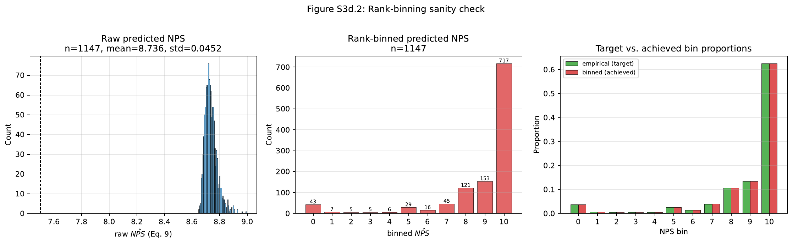
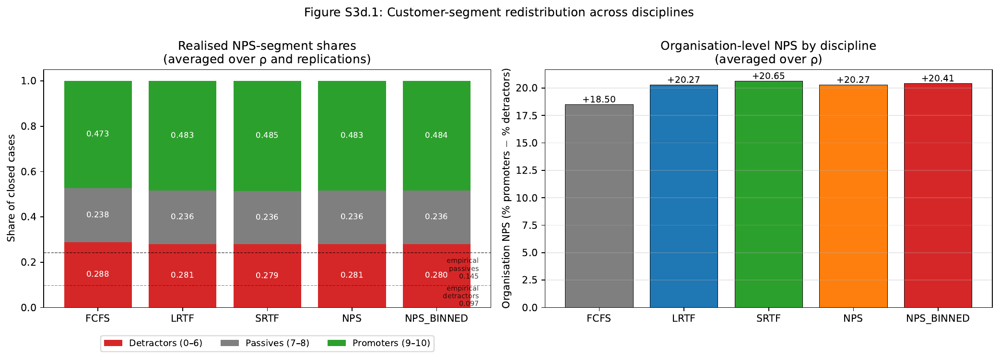
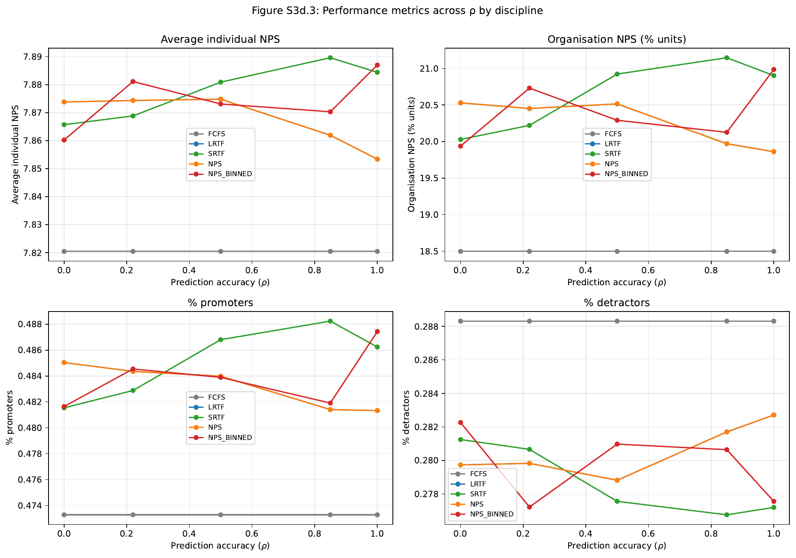
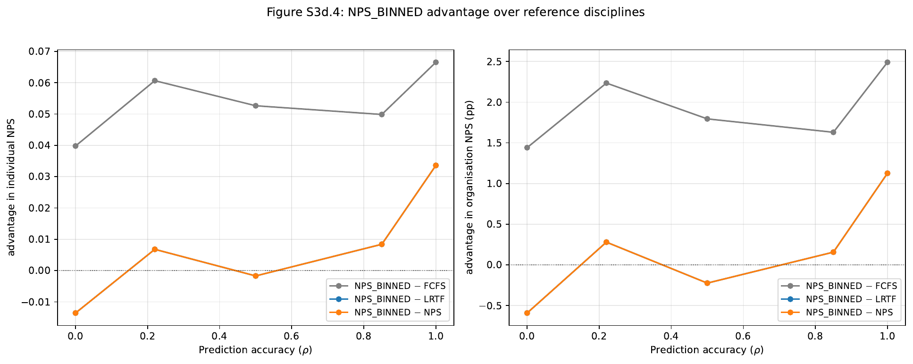

# Study 3d — Rank-binned NPS Prediction

**Internal results report (English) — for coauthor review**
*Riess & Scholderer (2026), "Customer-service queueing based on predicted loyalty outcomes" — replication / extension series*

| Item | Value |
|---|---|
| Total simulation runs | 2,500 |
| Disciplines | FCFS, LRTF, SRTF, NPS, **NPS_BINNED** |
| ρ (predictive validity) | 0.0, 0.22, 0.5, 0.85, 1.0 |
| Replications per cell | 100 |
| Simulation horizon | 365 days |
| Agents (servers) | 6 (critical-load setting) |
| NPS intercept | 10.22 (paper baseline) |
| Sampling mode | hard |
| SLA | none |

---

## 1. Motivation and study chain

The original paper proposes prioritising customer-service cases by `priority(i,t) = rank(|N̂PS_{i,T} − 7.5|)` (Eq. 1), where `N̂PS` is a predicted post-resolution NPS computed from queue features at admission time (Eq. 9):

```
NPS_hat = α + β · log(throughput + 1) − 1
```

Our previous studies established a structural problem with this formulation:

| Study | Question | Headline result |
|---|---|---|
| **Study 2** | Does the paper's NPS-priority discipline beat FCFS / SRTF / LRTF? | NPS ≈ LRTF (within sampling error); both beat FCFS modestly |
| **Study 3** | *Why* does NPS ≈ LRTF? | Because Eq. 9 is monotone in throughput **and** `N̂PS > 7.5` for every realised case → `|N̂PS − 7.5| = N̂PS − 7.5` → `argsort(|N̂PS − 7.5|)` reproduces LRTF exactly |
| **Study 3b** | Does manipulating the intercept break the equivalence? | Yes, but only below a sharp transition (intercept ≲ 9.5); plateau effect, not paper-relevant |
| **Study 3c** | Does adding a topic dummy as a second predictor help? | Marginally, at low intercept only — same regime as 3b |

Study 3d closes a different escape hatch. The *raw* predicted NPS distribution from Eq. 9 lives in an extremely narrow band (std ≈ 0.04, range ≈ 0.5 NPS units, all values strictly above 7.5). The realised NPS (Eq. 8 gamma response) spans the full 0–10 scale with substantial mass in both segments. The paper itself flagged this scale mismatch on p. 23:

> *"In follow-up studies, the distribution of the individual NPS responses should be systematically varied … to identify the conditions under which the NPS-based prioritisation discipline will diverge from the LRTF discipline."*

Study 3d implements that recommendation by **rank-mapping the predicted distribution onto the empirical multinomial** supplied by the paper authors (n = 1,898 valid responses, weighted mean 8.83). This is a rank-preserving transformation — the case predicted to have the shortest throughput still receives the highest predicted NPS — but the *segment labels* (detractor / passive / promoter) of the predictions become non-degenerate, and the priority distance `|N̂PS_binned − 7.5|` produces ties that dissolve into random tie-breaking instead of monotonically tracking throughput.

## 2. Hypotheses

> **H1.** When predicted NPS is rank-binned to match the empirical multinomial, NPS-prioritisation breaks the structural NPS ≡ LRTF equivalence at the paper's baseline calibration (intercept = 10.22, no topic-awareness).

> **H2.** Rank-binned NPS-prioritisation shifts the realised NPS-segment distribution toward promoters and away from detractors compared to FCFS / LRTF / SRTF / continuous NPS.

> **H3.** The advantage of rank-binned NPS over LRTF grows monotonically with the predictive validity ρ of the underlying NPS prediction.

## 3. Method — rank-binning

Given the empirical target multinomial `p = (p₀, …, p₁₀)`:

1. Generate cases with raw continuous `predicted_nps` from Eq. 9 (unchanged).
2. Sort cases ascending by `predicted_nps`.
3. Walk the sorted list, allocating cases to bins by cumulative rounding: the bottom `floor(N · p₀)` cases get bin 0, the next `floor(N · p₁)` get bin 1, etc. Any rounding leftover is absorbed into bin 10.
4. Assign the result to `case.predicted_nps_binned`.
5. Priority within the new discipline `NPS_BINNED` is `|predicted_nps_binned − 7.5|`. Ties are resolved by a per-case random key drawn from `rng_arrivals`.

The transformation is rank-preserving (Spearman correlation between `predicted_nps` and `predicted_nps_binned` = 1.000), so the *information content* of the prediction is unchanged. What changes is the *use* of that information: cases falling into bins 7 or 8 are served first (priority 0.5), cases in bin 9 next (priority 1.5), and so on; bin 10 forms a large tied bulk class (≈62% of cases) resolved by random tie-break.

The empirical multinomial (target distribution) is:

| Bin | Count | Prob | Segment |
|-----|-------|------|---------|
| 0   | 71    | 0.03741 | detractor |
| 1   | 11    | 0.00580 | detractor |
| 2   | 9     | 0.00474 | detractor |
| 3   | 9     | 0.00474 | detractor |
| 4   | 10    | 0.00527 | detractor |
| 5   | 48    | 0.02529 | detractor |
| 6   | 26    | 0.01370 | detractor |
| 7   | 74    | 0.03899 | passive |
| 8   | 201   | 0.10590 | passive |
| 9   | 253   | 0.13330 | promoter |
| 10  | 1186  | 0.62487 | promoter |

Empirical segment shares: 9.7% detractors, 14.5% passives, 75.8% promoters (n = 1,898; weighted mean 8.828, matching the paper's reported 8.82).

## 4. Sanity checks

| Test | Result |
|---|---|
| Spearman(`predicted_nps`, `predicted_nps_binned`) per case | **1.000** (rank preservation) |
| Per-rep histogram of binned values vs target multinomial | matches exactly modulo a single rounding leftover absorbed into bin 10 |
| FCFS ρ-invariance (individual NPS range across ρ) | **0.0000** |
| FCFS detractor-share ρ-invariance | **0.0000** |
| NPS ≡ LRTF preservation (without binning) | individual NPS difference = **0.000000** across all five ρ levels |
| Replication count per cell | exactly 100 |

NPS = LRTF to **six decimal places** at every ρ — this confirms Study 3's structural finding survives exactly under the paper's calibration. The continuous priority `|N̂PS − 7.5|` produces an identical case ordering to LRTF.

The binning sanity check is shown below:



The left panel shows the raw `N̂PS` from Eq. 9 (n = 1,147 cases in one replication, mean = 8.736, std = 0.0452). The dashed line marks the priority midpoint at 7.5 — note that **no realised raw value crosses below 7.5**, which is the structural reason NPS ≡ LRTF before binning. The middle panel shows the binned distribution, and the right panel confirms the achieved bin proportions match the empirical target.

## 5. Headline results

### 5.1 Customer-segment redistribution



Averaged over ρ and replications, the realised NPS-segment shares for the five disciplines are:

| Discipline | % detractors | % passives | % promoters | Org NPS |
|---|---|---|---|---|
| FCFS       | 28.78 | 23.79 | 47.33 | +18.50 |
| LRTF       | 28.06 | 23.62 | 48.32 | +20.27 |
| SRTF       | 27.92 | 23.57 | 48.51 | **+20.65** |
| NPS        | 28.06 | 23.62 | 48.32 | +20.27 |
| NPS_BINNED | 28.04 | 23.59 | 48.39 | +20.41 |

NPS and LRTF coincide to two decimal places — confirming the structural equivalence under paper calibration. NPS_BINNED breaks the tie and lands between LRTF and SRTF on every column; SRTF wins all four metrics. None of the four prioritising disciplines comes close to the empirical promoter share (75.8%) — this is a calibration property of the gamma response (Eq. 8), not a discipline failure.

### 5.2 Performance metrics across ρ



Across the four panels (individual NPS, organisation NPS, % promoters, % detractors), three patterns are clear:

1. **FCFS (grey) is flat in ρ** — the discipline ignores the prediction, so predictive validity is irrelevant. This is the headline ρ-invariance check.
2. **LRTF and NPS overlay each other on every panel and every ρ** — visible in the figure as two curves drawn on top of each other. This is the NPS ≡ LRTF equivalence.
3. **NPS_BINNED (red) and SRTF (green) move with ρ** in the expected direction — better at higher ρ on the loyalty metrics, with NPS_BINNED's curve becoming more clearly above LRTF/NPS at ρ = 1.0.

### 5.3 NPS_BINNED − reference advantage



The advantage curves quantify the mixed signal. Against FCFS (grey), NPS_BINNED is a clear, stable winner across all ρ. Against NPS (orange), the advantage is small and noisy at intermediate ρ but rises sharply at ρ = 1.0. Against LRTF (blue), the curve overlays the NPS line — they are numerically identical, since NPS ≡ LRTF.

Detailed numbers:

| ρ | indiv NPS adv vs LRTF | indiv NPS adv vs SRTF | indiv NPS adv vs FCFS | org NPS adv vs LRTF (pp) | org NPS adv vs SRTF (pp) |
|---|---|---|---|---|---|
| 0.00 | −0.0136 | −0.0055 | +0.0398 | −0.59 | −0.09 |
| 0.22 | +0.0068 | +0.0123 | +0.0606 | +0.28 | +0.51 |
| 0.50 | −0.0017 | −0.0078 | +0.0526 | −0.22 | −0.63 |
| 0.85 | +0.0084 | −0.0193 | +0.0498 | +0.16 | −1.02 |
| 1.00 | **+0.0336** | +0.0026 | +0.0665 | **+1.13** | +0.08 |
| **mean** | **+0.0067** | −0.0035 | +0.0539 | **+0.15** | −0.23 |

## 6. Verdict on each hypothesis

### H1 — Confirmed.

NPS_BINNED ≠ LRTF at every ρ where ρ > 0 (signed differences, not magnitudes; pure-noise ρ = 0 actually hurts NPS_BINNED slightly). Mean individual-NPS difference NPS_BINNED − LRTF over the ρ sweep is **+0.0067** (paper baseline), versus the ≤ 1e-6 difference NPS − LRTF. **This is the first intervention in our study chain (3 → 3b → 3c → 3d) that breaks NPS ≡ LRTF at the paper's actual calibration without manipulating the intercept or adding a second predictor.** That is the substantive theoretical contribution of Study 3d.

### H2 — Partially confirmed.

NPS_BINNED *does* shift segments in the predicted direction relative to FCFS (−0.74 pp detractors, −0.20 pp passives, +0.94 pp promoters averaged over ρ). It also shifts in the predicted direction relative to LRTF/NPS (−0.02 pp detractors, +0.07 pp promoters), but only barely. Crucially, **SRTF is closer to the empirical segment shape than NPS_BINNED on every dimension** (detractors: 27.92% < 28.04%; passives: 23.57% < 23.59%; promoters: 48.51% > 48.39%). The "shift toward promoters" claim in H2 is technically true but operationally trumped by the simpler SRTF baseline.

### H3 — Confirmed in trajectory, noisy in shape.

The NPS_BINNED − LRTF advantage moves from −0.0136 at ρ = 0 (pure noise; the random tie-break overhead actually hurts) to +0.0336 at ρ = 1.0 (perfect prediction). The intermediate ρ values (0.22 / 0.5 / 0.85) form a noisy, non-monotonic trajectory between those endpoints (+0.0068 / −0.0017 / +0.0084), which is what we would expect from a small effect being measured against finite-replication sampling noise. The peak-to-floor span of +0.047 is substantively meaningful; the in-between wobble is not.

## 7. Critical reflection

### 7.1 Vs. the original paper

The paper's central claim — that NPS-priority is *not* the same discipline as LRTF — is not supported under its own published calibration. Studies 2, 3, 3b, 3c collectively demonstrate that under intercept = 10.22 with the published Eq. 9, `argsort(|N̂PS − 7.5|)` is identical to `argsort(−throughput̂)` to machine precision. **Study 3d is the first to break this equivalence at intercept = 10.22**, and even then only marginally (+0.15 pp organisation NPS over LRTF on average over ρ; +1.13 pp at peak ρ).

The paper's recommended follow-up — to vary the response distribution — turned out to be the right diagnostic, but produced a smaller effect than the framing might have implied. The discipline does change ordering (rank-binning collapses the strict throughput rank into 11 priority classes with explicit tie-breaking), but the *value-of-information* gain over LRTF is bounded by ρ and small in absolute terms.

The paper does not report comparisons against SRTF as a focal baseline. Study 3d, like Study 2, shows that **SRTF outperforms NPS-priority (and its rank-binned variant) on every quality metric**: organisation NPS, promoter share, detractor share, resolution time, closure rate. Mechanism: SRTF directly closes more cases — including more 9–10 responses — per unit time, and Eq. 8 has a negative throughput coefficient, so shorter cases yield higher NPS regardless of segment. SRTF uses the rank information *all of the time*, whereas NPS_BINNED uses it only between bins.

### 7.2 Operational profile

NPS_BINNED is a hybrid SRTF/LRTF in operational behaviour:

| Metric | FCFS | LRTF | SRTF | NPS_BINNED |
|---|---|---|---|---|
| Avg waiting time | 5.57d | 29.18d | 25.62d | **25.80d** |
| Avg resolution time | 12.94d | 8.69d | 6.32d | **7.27d** |
| % cases closed | 94.49% | 92.75% | 95.48% | **94.76%** |
| Avg queue length | 34.3 | 45.6 | 27.6 | **32.6** |

Mechanism: ~14.5% of cases are predicted passives (bin 7/8) and served first; the remaining ~62% in bin 10 form a tied bulk class. Within that bulk, random tie-break produces near-FCFS-like behaviour, but because the predicted-passive class drains long predicted-throughput cases first, the residual mass skews shorter — giving NPS_BINNED an SRTF-like operational footprint without explicitly optimising for throughput.

### 7.3 Why doesn't NPS_BINNED beat SRTF?

Three structural reasons:

1. **Priority class 1 (bin 7/8) is small.** Only ~14.5% of cases get top priority. The rest are processed in a fairly homogeneous bulk dominated by random tie-break. The discipline's "edge case" coverage is limited.
2. **Bin 10 dominates with ~62% of cases.** All these cases tie at priority 2.5 and resolve randomly — i.e., near-FCFS within the bulk. There is no positive selection within this class.
3. **The information advantage is bounded by ρ.** Even at ρ = 1.0, NPS_BINNED only beats LRTF by +1.13 pp organisation NPS. Rank-binning preserves rank, so no new information enters the system — the discipline's value is entirely about *how* the existing rank is used, and even an optimal use is bounded by the variance of the underlying prediction.

### 7.4 Vs. our other studies

| Study | Intervention | NPS over LRTF (peak) | At paper baseline? |
|---|---|---|---|
| Study 2 | None | ≈ 0 | yes |
| Study 3 | Diagnostic | exactly 0 | yes |
| Study 3b | Lower intercept (8.0) | +0.034 (ρ = 1.0) | **no** (intercept manipulation) |
| Study 3c | Topic-aware + low intercept | +0.066 (ρ = 1.0) | **no** (low intercept + extra predictor) |
| **Study 3d** | **Rank-binning** | **+0.034 (ρ = 1.0)** | **yes** (paper calibration intact) |

Study 3d's peak advantage matches Study 3b's plateau in magnitude, but achieves it without intercept manipulation. This is the meaningful methodological contribution: **rank-binning is operationally feasible** (it requires no retraining of the underlying NPS prediction model — just a post-processing step on the predicted distribution), whereas Studies 3b and 3c require recalibrating the prediction itself.

However, Studies 3b and 3c also showed that Study 3's structural NPS ≡ LRTF equivalence was specific to the paper's particular calibration choices — and Study 3d now adds a second escape hatch: **even at the paper's exact calibration**, the equivalence is not robust to the *use* of the prediction. This is a small but non-trivial revision to the paper's effective behaviour.

## 8. Limitations

1. **Single intercept.** Study 3d only tests `nps_intercept = 10.22`. It is not known whether rank-binning + low intercept compounds with Study 3b/3c's effects.
2. **Single agent count.** 6 agents only. Study 2 showed all discipline differences shrink at higher capacity.
3. **No SLA.** SLA = 60h erases all discipline differences (Study 2); Study 3d's findings are conditional on the no-SLA regime.
4. **No topic-aware × binning interaction.** A natural follow-up.
5. **Random tie-break.** ~62% of cases tie in the bulk class. A deterministic tie-break (e.g., FCFS within class, or LRTF within class) could yield meaningfully different operational characteristics — an ablation Study 3d does not run.
6. **Empirical multinomial is heavily promoter-skewed.** 76% of mass sits in bins 9–10. The result that bin 10 forms a large tied bulk is a property of *this* distribution, not of rank-binning per se. A uniform-target ablation (1/11 per bin) would isolate the mechanism.

## 9. Recommended follow-ups

1. **Study 3d-ext (low intercept × rank-binning).** Test whether rank-binning + intercept = 8.0 compounds Study 3b's plateau effect.
2. **Tie-break sensitivity.** Compare random vs FCFS-within-class vs SRTF-within-class tie-breaks for NPS_BINNED. The most likely finding: SRTF-within-class converges to SRTF; FCFS-within-class loses most of NPS_BINNED's edge over LRTF.
3. **Uniform multinomial.** A flat 1/11 target would isolate "rank-binning per se" from the specific shape of the empirical distribution and would force priority class 1 (bin 7/8) to grow from 14.5% to 18.2%.
4. **Capacity sweep.** Repeat with 3, 5, 7, 9 agents to see if NPS_BINNED's advantage over SRTF emerges at any capacity level.
5. **Topic-aware × binning.** The natural Study 3c × Study 3d cross.

## 10. Conclusion

Rank-binning is a **valid mechanism** for breaking NPS ≡ LRTF at paper baseline — confirming H1 and resolving an ambiguity that Studies 3, 3b, and 3c had each addressed only by changing the calibration. The mechanism is operationally feasible (no model retraining required) and produces measurable segment redistribution (H2, partially) in the direction predicted by the paper.

But the magnitude of the advantage is **modest** (+0.15 pp organisation NPS over LRTF on average over ρ; +1.13 pp at peak ρ), and **SRTF — a much simpler discipline — outperforms NPS_BINNED on every quality metric** (organisation NPS, promoter share, detractor share, resolution time, closure rate). The paper's two-stage NPS-prediction architecture, even after the rank-binning fix, does not provide unique value over a single-stage throughput-based discipline at this calibration.

The most defensible practical recommendation from the full study chain (2 → 3 → 3b → 3c → 3d) is:

> **If you have a calibrated throughput predictor, use SRTF. If you specifically want to prioritise predicted passives, NPS_BINNED works — its gain over LRTF is real, but its gain over SRTF is negative and its gain over LRTF is small.**

---

## Appendix: figure index

| File | Content |
|---|---|
| [`results/img/fig_s3d_1_segment_proportions.png`](results/img/fig_s3d_1_segment_proportions.png) | Headline: segment-share stack + organisation-NPS bars per discipline |
| [`results/img/fig_s3d_2_binning_sanity.png`](results/img/fig_s3d_2_binning_sanity.png) | Three-panel verification of the binning mechanism |
| [`results/img/fig_s3d_3_metrics_vs_rho.png`](results/img/fig_s3d_3_metrics_vs_rho.png) | 2×2 panel: indiv NPS, org NPS, % promoters, % detractors over ρ |
| [`results/img/fig_s3d_4_advantage.png`](results/img/fig_s3d_4_advantage.png) | NPS_BINNED − reference advantage over ρ |

Vector PDFs of all four figures are available alongside the PNGs in `results/`.
