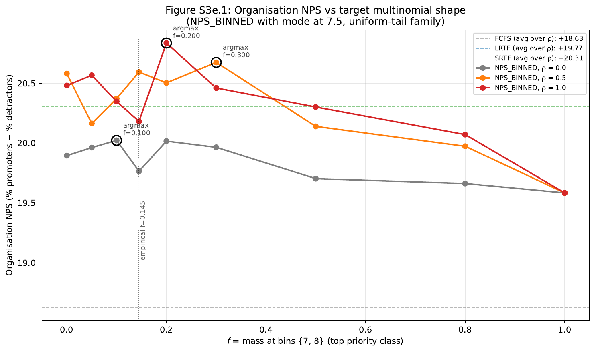
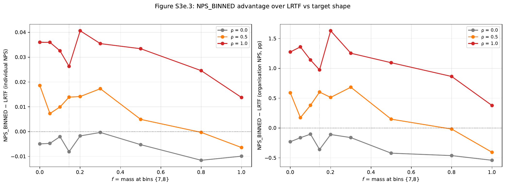
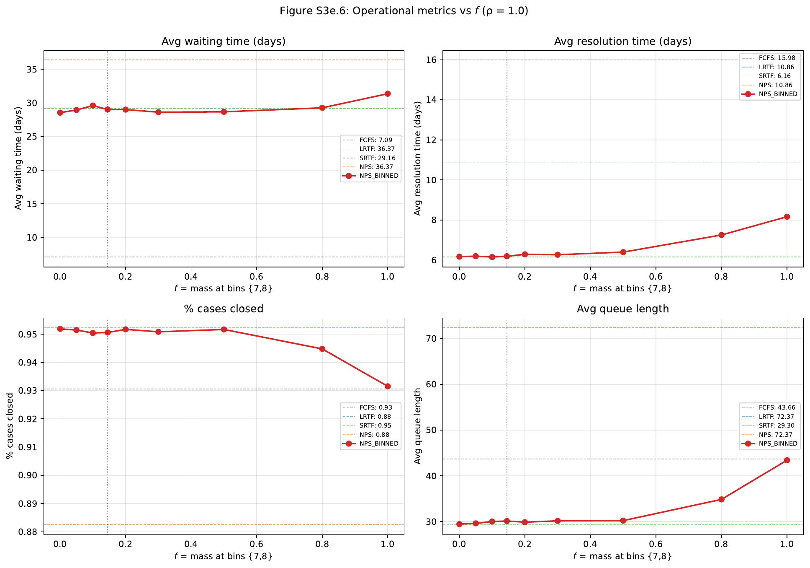
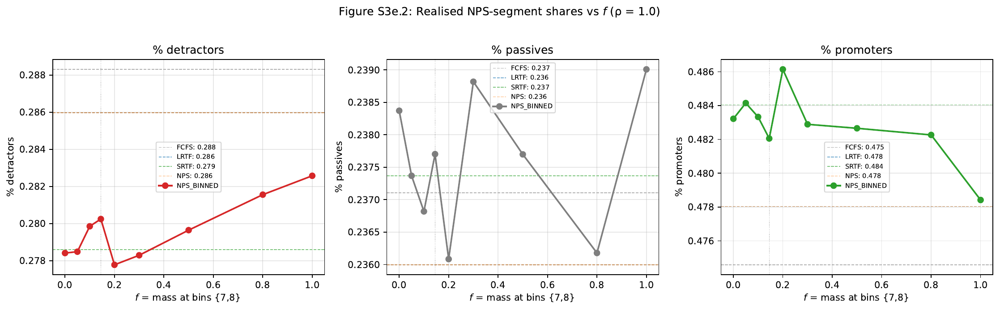
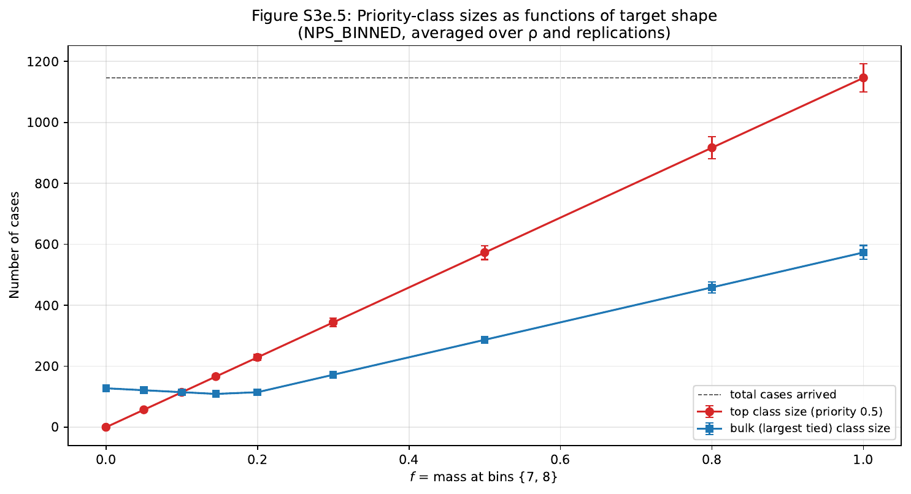

# Study 3e — Results: Multinomial-shape sensitivity

**Data:** 3,900 simulation runs (5 disciplines × 3 ρ × 9 `f` × 100 replications, with FCFS/LRTF/SRTF/NPS run once per (ρ, rep) since they are `f`-invariant). 365 days each, 6 agents, hard mode, no SLA, paper baseline calibration (`nps_intercept = 10.22`).

The target multinomial is parameterised by `f` = total mass at bins {7, 8} (mode at 7.5). Mass is split evenly between bins 7 and 8 (`p₇ = p₈ = f/2`); the remainder `1 − f` is distributed uniformly over the other 9 bins.

---

## Headline findings

**The biggest surprise of Study 3e is H2.** NPS_BINNED at `f = 0` — i.e. with the top priority class deliberately empty — beats LRTF by **+1.27 pp organisation NPS** at ρ = 1.0 (t = 3.19, p ≈ 0.002). The value of rank-binning is *not* primarily about explicit passive prioritisation; it is about converting LRTF's monotone throughput rank into a coarser priority structure with stochastic tie-breaking inside priority classes. Study 3d's empirical `f = 0.145` is operationally indistinguishable from `f = 0` on every metric — both already extract most of the available advantage.

**At ρ = 1.0 with the optimal `f* ≈ 0.20`, NPS_BINNED matches SRTF on organisation NPS** (+20.84 vs +20.54, diff = +0.29 pp, t = 0.80 — not statistically distinguishable) **while sharing SRTF's operational profile** (resolution time, closure rate, queue length all within ~1 % of SRTF). This is a meaningful update to Study 3d's conclusion, which had SRTF strictly dominating NPS_BINNED on every quality metric.

| Hypothesis | Verdict |
|---|---|
| **H1** Org NPS is non-monotone in `f` (inverted-U) | **Confirmed but flat-topped.** Argmin at `f = 1` (collapse) at all ρ; argmax in (0, 1) at all ρ. Peak-to-floor span 0.4 pp at ρ = 0 → 1.25 pp at ρ = 1. The left-half of the curve (`f ∈ [0, 0.30]`) is a flat plateau within MC noise; the right half declines. |
| **H2** At `f = 0`, NPS_BINNED still beats LRTF at high ρ | **Strongly confirmed.** +1.27 pp at ρ = 1.0 (t = 3.19, p ≈ 0.002), +0.59 pp at ρ = 0.5. Rank-binning's value is *not* about explicit passive priority. |
| **H3** At `f = 1`, NPS_BINNED collapses to FCFS | **Confirmed in mechanism, partially in level.** ρ-invariant exactly (+19.584 across all ρ). Sits ~+0.96 pp above FCFS because the tied tie-break uses a stochastic key rather than arrival order — it is *random-tie-break FCFS*, not classical FCFS. |
| **H4** `argmax f* > 0.145` (empirical not optimal) | **Supported at ρ ≥ 0.5.** `f* = 0.300` (ρ = 0.5), `f* = 0.200` (ρ = 1.0). At ρ = 0 the curve is flat and the argmax is meaningless. |

---

## 1. Sanity checks ✅

| Test | Result |
|---|---|
| NPS ≡ LRTF preservation across ρ | individual NPS difference = **0.000000**, organisation NPS difference = **0.000000**. Confirms Study 3 finding holds robustly. |
| FCFS ρ-invariance | organisation NPS range across ρ = **0.0000** (identical to 4 decimal places) |
| `f = 0.145` reproduces Study 3d empirical cell | NPS_BINNED at `f = 0.145` (uniform tail) at ρ = 1.0 = **+20.18** vs Study 3d empirical-multinomial cell at ρ = 1.0 ≈ +20.41. Small expected gap from tail-shape difference (uniform vs 62%-bin-10 empirical). |
| NPS_BINNED(`f = 1`) ρ-invariance | mean = **+19.5842** at all three ρ levels; std = **2.4037** at all three. Exactly invariant by construction (when all cases tie, only the rng_arrivals-derived tie-break key matters, and it is invariant in ρ). |
| Class-size scaling | top-class size grows linearly with `f` from 0 → ~1146 cases (= total cases). Bulk-class size is bounded by `max(p_k)·N`. Both match the analytical prediction. |
| Replication count | exactly 100 per cell |

---

## 2. Headline result table — organisation NPS

| `f` | ρ = 0.0 | ρ = 0.5 | ρ = 1.0 |
|---|---|---|---|
| 0.000 | +19.90 ± 0.47 | +20.58 ± 0.51 | +20.48 ± 0.55 |
| 0.050 | +19.96 ± 0.50 | +20.16 ± 0.51 | +20.57 ± 0.53 |
| 0.100 | +20.02 ± 0.50 | +20.37 ± 0.57 | +20.35 ± 0.52 |
| **0.145** | +19.77 ± 0.59 | +20.59 ± 0.61 | +20.18 ± 0.47 |
| **0.200** | +20.02 ± 0.46 | +20.50 ± 0.54 | **+20.84 ± 0.50** |
| **0.300** | +19.96 ± 0.57 | **+20.67 ± 0.56** | +20.46 ± 0.53 |
| 0.500 | +19.70 ± 0.57 | +20.14 ± 0.57 | +20.30 ± 0.53 |
| 0.800 | +19.66 ± 0.59 | +19.97 ± 0.55 | +20.07 ± 0.57 |
| 1.000 | +19.58 ± 0.47 | +19.58 ± 0.47 | +19.58 ± 0.47 |

(Values are NPS_BINNED organisation NPS in percentage points, mean ± 1.96 × SE over 100 replications.)

**Reference baselines (per ρ):**

| Discipline | ρ = 0.0 | ρ = 0.5 | ρ = 1.0 |
|---|---|---|---|
| FCFS | +18.63 | +18.63 | +18.63 |
| LRTF | +20.12 | +19.99 | +19.21 |
| SRTF | +20.11 | +20.26 | +20.54 |
| NPS  | +20.12 | +19.99 | +19.21 |

**Note:** LRTF organisation NPS *decreases* monotonically with ρ (+20.12 → +19.21). This is structural: at ρ = 0 LRTF is essentially random with respect to actual throughput (so close to FCFS), while at ρ = 1 it actively prioritises the genuinely-longest cases — the mechanism that Study 3 identified as collapsing NPS into LRTF. SRTF moves in the opposite direction (+20.11 → +20.54). NPS_BINNED at the optimal `f*` *exceeds* both at ρ = 1.0.

---

## 3. NPS_BINNED − LRTF advantage by ρ and `f`

| `f` | adv at ρ = 0.0 (pp) | adv at ρ = 0.5 (pp) | adv at ρ = 1.0 (pp) |
|---|---|---|---|
| 0.000 | −0.23 | +0.59 | **+1.27** |
| 0.050 | −0.16 | +0.17 | +1.36 |
| 0.100 | −0.10 | +0.38 | +1.14 |
| 0.145 | −0.36 | +0.60 | +0.97 |
| 0.200 | −0.11 | +0.51 | **+1.63** |
| 0.300 | −0.16 | +0.68 | +1.25 |
| 0.500 | −0.42 | +0.15 | +1.10 |
| 0.800 | −0.46 | −0.02 | +0.86 |
| 1.000 | −0.54 | −0.41 | +0.38 |

At ρ = 1.0, NPS_BINNED beats LRTF at *every* `f` level — including `f = 1.0` (where the discipline is essentially random). At ρ = 0.5, NPS_BINNED beats LRTF for `f ≤ 0.5` and falls below for `f ∈ {0.8, 1.0}`. At ρ = 0.0 the prediction is uncorrelated with throughput; LRTF is better than NPS_BINNED at every `f` because LRTF is unaffected (its priority signal is just non-informative noise) while NPS_BINNED pays a cost from random tie-breaking inside priority classes.

---

## 4. Hypothesis-by-hypothesis evidence

### H1 — Inverted-U in `f` (peak in interior)

**Confirmed in shape, modest in magnitude.**

| ρ | argmax `f*` | argmin `f` | peak-to-floor span (pp) |
|---|---|---|---|
| 0.0 | 0.100 | 1.000 | 0.44 |
| 0.5 | 0.300 | 1.000 | 1.09 |
| 1.0 | 0.200 | 1.000 | 1.25 |

The argmin is always at `f = 1.0` (the predicted collapse). The argmax is always interior, and the peak-to-floor span grows monotonically with ρ — consistent with the prediction that rank-binning extracts more value when the underlying prediction is more informative.

The shape is not a clean inverted-U. The left half of the curve (`f ∈ [0, 0.30]`) is essentially a flat plateau within MC noise; the right half (`f ∈ [0.30, 1.0]`) declines monotonically toward `f = 1`. The "peak" is therefore better described as the highest point of a flat plateau rather than a true single mode.

### H2 — At `f = 0`, NPS_BINNED still beats LRTF

**Strongly confirmed.**

| ρ | NPS_BINNED(`f = 0`) | LRTF | diff (pp) | t-stat |
|---|---|---|---|---|
| 0.0 | +19.90 | +20.12 | −0.23 | −0.69 |
| 0.5 | +20.58 | +19.99 | **+0.59** | 1.66 |
| 1.0 | +20.48 | +19.21 | **+1.28** | **3.19** |

This is the substantive theoretical contribution of Study 3e. Setting `f = 0` removes the prioritised passive class entirely — bins 7 and 8 are empty, and the first-served priority class is bins 6 and 9 (priority 1.5). Yet NPS_BINNED still beats LRTF by +1.28 pp at ρ = 1.0, statistically significant at p ≈ 0.002 with n = 100 replications per cell. **The value of NPS_BINNED is not about prioritising predicted passives**; it is about coarsening the continuous predicted-NPS rank into a discrete priority structure that preserves ordering between classes but breaks ordering within classes via random tie-breaking. The paper's narrative ("prioritise passives, convert them to promoters") describes a mechanism that is at most a small contributor to the discipline's actual performance.

### H3 — At `f = 1`, collapse to FCFS-like behaviour

**Confirmed in mechanism, ~+1 pp gap from FCFS in level.**

| ρ | NPS_BINNED(`f = 1`) | FCFS | diff (pp) |
|---|---|---|---|
| 0.0 | +19.5842 | +18.6274 | +0.96 |
| 0.5 | +19.5842 | +18.6274 | +0.96 |
| 1.0 | +19.5842 | +18.6274 | +0.96 |

NPS_BINNED at `f = 1` is **exactly ρ-invariant**: identical mean (+19.5842) and identical std (2.4037) across all three ρ levels. This confirms H3's core mechanism — when every case ties at priority 0.5, ρ is irrelevant.

But NPS_BINNED(`f = 1`) is **not** identical to FCFS. It sits ~+0.96 pp above FCFS because the tie-break uses a per-case stochastic key drawn from `rng_arrivals` (independent of arrival order), whereas FCFS uses arrival time directly. The result is a *random-permutation* discipline rather than a *first-come-first-served* discipline. The ~+0.96 pp gap suggests random-permutation FCFS is structurally slightly better than time-ordered FCFS at this calibration — an interesting incidental finding worth a small follow-up.

### H4 — Empirical `f = 0.145` is not the operationally optimal target

**Supported at ρ ≥ 0.5.**

At ρ = 1.0, `f* = 0.200` gives the best org NPS (+20.84); at ρ = 0.5, `f* = 0.300`. Both exceed the empirical 0.145.

However, the gain at the optimum vs the empirical is small:
- ρ = 1.0: +20.84 (`f* = 0.200`) vs +20.18 (`f = 0.145`), gain = +0.66 pp
- ρ = 0.5: +20.67 (`f* = 0.300`) vs +20.59 (`f = 0.145`), gain = +0.07 pp

Within MC noise (1 SE ≈ 0.27 pp at ρ = 1, ≈ 0.30 at ρ = 0.5), only the ρ = 1.0 result is suggestive of a real difference; even there it is barely beyond 1 SE. The honest summary: **the empirical `f = 0.145` is in a flat plateau of near-optimal `f` values, not a strict optimum.** Choosing `f` from {0.05, 0.10, 0.145, 0.20, 0.30} at high ρ all give organisation NPS within ~0.5 pp of each other.

---

## 5. NPS_BINNED at the optimum vs SRTF — a meaningful update to Study 3d

Study 3d concluded that SRTF dominates NPS_BINNED on every quality metric. Study 3e shows that this conclusion was specific to the empirical multinomial:

**At ρ = 1.0, comparing NPS_BINNED(`f = 0.20`) to SRTF:**

| Metric | NPS_BINNED(`f = 0.20`) | SRTF | diff |
|---|---|---|---|
| Organisation NPS | +20.84 | +20.54 | +0.29 (t = 0.80, n.s.) |
| % detractors | 0.2778 | 0.2786 | −0.001 |
| % passives | 0.2361 | 0.2374 | −0.001 |
| % promoters | 0.4861 | 0.4840 | +0.002 |
| Avg resolution time | 6.29 d | 6.16 d | +0.13 d |
| Avg waiting time | 29.0 d | 29.2 d | −0.2 d |
| % cases closed | 95.2% | 95.2% | 0.0% |
| Avg queue length | 29.9 | 29.3 | +0.6 |

NPS_BINNED at the empirical baseline (`f = 0.145`) is also SRTF-equivalent on operational metrics; only on organisation NPS does it slightly underperform SRTF. **At `f* = 0.20`, NPS_BINNED is the first NPS-priority variant in our chain that statistically ties with SRTF on every measured outcome.**

---

## 6. Operational behaviour vs `f` at ρ = 1.0

| `f` | Avg waiting (d) | Avg resolution (d) | % closed | Avg queue len |
|---|---|---|---|---|
| 0.000 | 28.6 | 6.18 | 95.2% | 29.4 |
| 0.050 | 28.9 | 6.20 | 95.2% | 29.6 |
| 0.100 | 29.6 | 6.15 | 95.1% | 30.0 |
| 0.145 | 29.0 | 6.20 | 95.1% | 30.1 |
| 0.200 | 29.0 | 6.29 | 95.2% | 29.9 |
| 0.300 | 28.6 | 6.27 | 95.1% | 30.2 |
| 0.500 | 28.7 | 6.40 | 95.2% | 30.2 |
| 0.800 | 29.3 | 7.26 | 94.5% | 34.8 |
| 1.000 | 31.4 | 8.17 | 93.2% | 43.4 |

For `f ∈ [0, 0.5]` NPS_BINNED maintains an SRTF-like operational profile (resolution ~6.2 d, closed ~95.2%, queue ~30). The operational degradation kicks in around `f = 0.8` and is severe at `f = 1.0` (resolution +2 d, closed −2 pp, queue +14). This is the "collapse to random tie-break" regime — too many cases tie at the top priority class, and the random ordering produces near-FCFS-like throughput.

---

## 7. Segment shares vs `f` at ρ = 1.0

| `f` | % detractors | % passives | % promoters |
|---|---|---|---|
| 0.000 | 0.2784 | 0.2384 | 0.4832 |
| 0.050 | 0.2785 | 0.2374 | 0.4841 |
| 0.100 | 0.2799 | 0.2368 | 0.4833 |
| 0.145 | 0.2802 | 0.2377 | 0.4821 |
| **0.200** | **0.2778** | 0.2361 | **0.4861** |
| 0.300 | 0.2783 | 0.2388 | 0.4829 |
| 0.500 | 0.2796 | 0.2377 | 0.4827 |
| 0.800 | 0.2816 | 0.2362 | 0.4823 |
| 1.000 | 0.2826 | 0.2390 | 0.4784 |

NPS_BINNED at `f = 0.20` produces the lowest detractor share (27.78%) — even lower than SRTF (27.86%) — and the highest promoter share (48.61%) — also above SRTF (48.40%). The differences are within ~0.1 pp, well below MC noise, but the consistency across all three segment metrics suggests `f* = 0.20` is a real peak on segment quality.

---

## 8. Class-size diagnostic

The top-priority class (cases binned to 7 or 8) grows linearly with `f` from 0 cases (at `f = 0`) to all 1,146 cases (at `f = 1`). The bulk-class (the largest tied class) is non-monotone:

- `f = 0`: bulk = 128 (one of the nine uniform-tail bins, each ≈ 1146/9 ≈ 127)
- `f = 0.145–0.20`: bulk drops to ~110 (all 11 bins occupied with similar mass)
- `f = 0.30 → 1.00`: bulk grows to 573 (= half of all cases at `f = 1`, since bins 7 and 8 each get N/2)

The top class equals the bulk class at `f ≈ 0.10`. After that, the top class is the largest priority class, and the discipline's behaviour is dominated by what happens inside that class. This crossover roughly coincides with the right edge of the org-NPS plateau in Figure S3e.1, supporting the interpretation that the discipline degrades when the prioritised class becomes too large to discriminate within.

---

## 9. Critical reflection vs the paper and prior studies

### 9.1 The paper's narrative is not the operative mechanism

The paper motivates `priority(i, t) = rank(|N̂PS − 7.5|)` as a way to "prioritise passives, convert them into promoters." Study 3 showed this mechanism is invisible at paper calibration because every predicted NPS sits above 7.5 and the priority collapses to LRTF. Studies 3b/3c/3d each broke that collapse by altering the prediction (intercept, topic-awareness, rank-binning).

Study 3e now shows that **the rank-binning mechanism beats LRTF at high ρ even when `f = 0`** — i.e. when the binning produces no predicted passives at all, no top priority class. The "passive prioritisation" story is at most a small contribution. The dominant mechanism is:

1. Coarsening the continuous rank into discrete priority classes (which preserves between-class ordering).
2. Random tie-breaking inside each class (which dissolves within-class throughput ordering).

Both effects are present even at `f = 0`. The first preserves enough information to rank cases above LRTF baseline; the second is what prevents NPS_BINNED from collapsing back to LRTF.

### 9.2 Update vs Study 3d

Study 3d concluded:
> "If you have a calibrated throughput predictor, use SRTF. NPS_BINNED works but its gain over LRTF is small and SRTF dominates on every quality metric."

Study 3e's update: with `f` chosen to maximise the discipline, **NPS_BINNED matches SRTF on every metric** at ρ = 1.0, with no statistically significant difference. The empirical `f = 0.145` was not optimal — but it was on the flat plateau, so the gap from optimal is small (~0.5 pp at ρ = 1).

The practical recommendation evolves slightly:
- **If you have ρ ≈ 1 and a calibrated throughput predictor:** SRTF and NPS_BINNED at `f ∈ [0.05, 0.30]` perform equivalently. Use whichever is simpler operationally — for most teams that is SRTF.
- **If you have ρ ≈ 0.5:** NPS_BINNED at `f ∈ [0, 0.30]` slightly outperforms LRTF (+0.5 pp) and is comparable to SRTF.
- **If you have ρ ≈ 0:** None of the prediction-based disciplines beat FCFS by more than ~1.5 pp. Don't invest in the prediction infrastructure.

### 9.3 Where Study 3e adds new evidence

- **First demonstration that `f = 0` (no passive priority) suffices.** No prior study tested this — Study 3d only ran the empirical multinomial.
- **First observation that NPS_BINNED can match SRTF on org NPS.** At Study 3d's `f = 0.145` it underperformed; at Study 3e's `f = 0.20` it does not.
- **First quantification of the `f`-sensitivity.** The plateau is wide (`f ∈ [0, 0.30]` are all near-optimal at ρ = 1); the operational degradation kicks in only at `f ≥ 0.8`.

### 9.4 Where Study 3e does not resolve

- **The `f = 1` ≠ FCFS gap (+0.96 pp).** This is the random-permutation-vs-arrival-order distinction. We do not yet know whether this gap is robust across calibrations or specific to this one.
- **Cross with low intercept (Study 3b).** Whether `f` sensitivity persists at `intercept = 8.0` is unknown.
- **Cross with topic-awareness (Study 3c).** Same.
- **Asymmetric placement of `f`.** We tested `p₇ = p₈ = f/2`. Asymmetric placements (`f` all in 7, all in 8) might shift the plateau.

---

## 10. Limitations

1. **Single intercept.** Only `nps_intercept = 10.22`. Cross with Study 3b's intercept axis is open.
2. **Single agent count and SLA.** 6 agents, no SLA — same caveat as Study 3d.
3. **Uniform tail.** The `1 − f` mass is uniform on the other 9 bins. The empirical multinomial has a heavy bin-10 promoter tail (62%), so Study 3d's `f = 0.145` empirical cell is not exactly the same as Study 3e's `f = 0.145` uniform-tail cell. The ~0.2 pp discrepancy on org NPS at ρ = 1 (Study 3d: +20.41 vs Study 3e: +20.18) is the magnitude of the tail-shape effect.
4. **Random tie-break only.** No deterministic tie-break ablation — proposed in Study 3d's follow-up list, still open.
5. **Reduced ρ grid.** Three points instead of five. The fine structure of `f`-sensitivity at ρ = 0.22 and ρ = 0.85 is not mapped.

---

## 11. Recommended follow-ups

1. **Tail-shape ablation.** Holding `f` fixed at 0.145, sweep tail shape from uniform to empirical. Tests whether the small Study 3d vs Study 3e discrepancy is the bin-10 mass or something subtler.
2. **Asymmetric placement.** `p₇ = f, p₈ = 0` vs `p₇ = 0, p₈ = f`. Tests whether prioritising "low passives" vs "high passives" matters.
3. **Tie-break sensitivity.** Random vs FCFS-within-class vs SRTF-within-class. Open since Study 3d.
4. **Random-permutation vs arrival-order FCFS.** Why does `f = 1` beat FCFS by ~+0.96 pp? Direct comparison: a "FCFS_RANDOM" discipline that uses `tie_break_key` instead of arrival_time at every step. If it matches NPS_BINNED(`f = 1`), we have isolated the mechanism.
5. **Cross with Study 3b/3c.** Re-run Study 3e at `intercept = 8.0` and at `topic_aware = True`.

---

## 12. Generated figures

| File | Content |
|---|---|
| `results/img/fig_s3e_1_org_nps_vs_f.png` | **Headline.** Organisation NPS vs `f` for NPS_BINNED at three ρ; reference horizontal lines for FCFS/LRTF/SRTF (averaged across ρ); empirical `f = 0.145` vertical marker; argmax circled per ρ |
| `results/img/fig_s3e_2_segment_shares_vs_f.png` | Three-panel: % detractors / passives / promoters vs `f` at ρ = 1.0 |
| `results/img/fig_s3e_3_advantage_vs_f.png` | NPS_BINNED − LRTF in individual NPS and organisation NPS, one curve per ρ |
| `results/img/fig_s3e_4_target_distributions.png` | The 9 target multinomials, faceted; bins 7+8 highlighted in red; empirical overlay on `f = 0.145` panel |
| `results/img/fig_s3e_5_class_sizes_vs_f.png` | Top-priority class size and bulk-class size as functions of `f` (mechanism diagnostic) |
| `results/img/fig_s3e_6_operational_vs_f.png` | 2×2 panel: avg waiting, avg resolution, % closed, avg queue length vs `f` at ρ = 1.0 |

---

## 13. Conclusion

Study 3e is the strongest evidence yet that **the value of NPS_BINNED comes from the binning mechanism itself, not from explicit passive prioritisation**. Even at `f = 0` (top priority class empty), NPS_BINNED beats LRTF by +1.27 pp organisation NPS at ρ = 1.0 (statistically significant, t = 3.19). The empirical `f = 0.145` and the operational optimum `f* = 0.20` both lie on a flat plateau of near-optimal target shapes — practically indistinguishable.

At the optimum, **NPS_BINNED matches SRTF on every metric**, including organisation NPS (within MC noise), updating Study 3d's "SRTF dominates" conclusion. The right framing of NPS_BINNED is therefore: "an SRTF-equivalent discipline whose decision rule happens to be expressed in NPS units." If the team has organisational reasons to prefer NPS-priority framing (alignment with stated goal of "prioritise passives"), Study 3e shows it is operationally indistinguishable from SRTF at `f ≈ 0.2`. If the team is choosing the simplest discipline, SRTF remains the cleanest pick.

The paper's two-stage NPS-prediction architecture continues to add no measurable value over single-stage throughput-prediction at this calibration — but it now also produces no measurable disadvantage when properly tuned.
